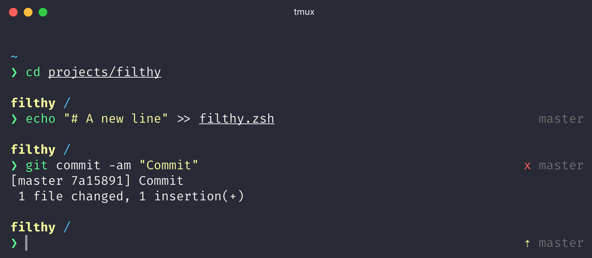
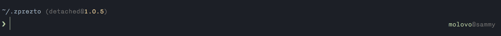
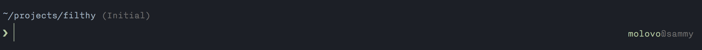
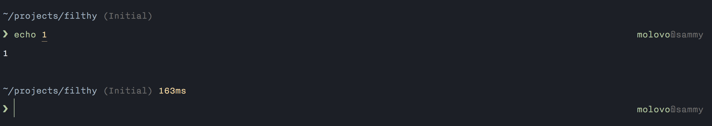

# Filthy

> A disgustingly clean ZSH prompt




## Overview

Based on the great [pure theme](http://github.com/sindresorhus/pure) by [@sindresorhus](http://github.com/sindresorhus) and [@mafredri](https://github.com/mafredri), but with a few notable changes.

* Prompt character is now green when previous command was successful.
* Git repo info is wrapped in parentheses for clearer separation.
* Calls to git-info/vcs-info plugins replaced with native git commands.
* Current commit/tag shown if HEAD is detached.
  
* 'Initial' status is shown in a new repo
  
* User and host always shown in RPROMPT, green for standard users, red if privileged.
* Command execution time shows in ms if less than one second has elapsed.
  
* Temporary messages can be displayed in the pre-prompt, e.g. to show feedback after an asynchronous command has completed.

## Install

Can be installed with `npm` or manually. Requires git 2.0.0+ and ZSH 5.0.0+.

### npm

```
$ npm install --global filthy-prompt
```

That's it. Skip to [Getting started](#getting-started).

### Manually

1. Either…
  - Clone this repo
  - add it as a submodule, or
  - just download `filthy.zsh`

2. Symlink `filthy.zsh` to somewhere in [`$fpath`](http://www.refining-linux.org/archives/46/ZSH-Gem-12-Autoloading-functions/) with the name `prompt_filthy_setup`.

#### Example

```
$ ln -s "$PWD/filthy.zsh" /usr/local/share/zsh/site-functions/prompt_filthy_setup
```
*Run `echo $fpath` to see possible locations.*

For a user-specific installation (which would not require escalated privileges), simply add a directory to `$fpath` for that user:

```sh
# .zshenv or .zshrc
fpath=( "$HOME/.zfunctions" $fpath )
```

Then install the theme there:

```sh
$ ln -s "$PWD/filthy.zsh" "$HOME/.zfunctions/prompt_filthy_setup"
```

## Getting started

Initialize the prompt system (if not so already) and choose `filthy`:

```sh
# .zshrc
autoload -U promptinit && promptinit
prompt filthy
```


## Options

### `FILTHY_CMD_MAX_EXEC_TIME`

The max execution time of a process before its run time is shown when it exits. Defaults to `5` seconds.

## Example

```sh
# .zshrc

autoload -U promptinit && promptinit

# optionally define some options
FILTHY_CMD_MAX_EXEC_TIME=10

prompt filthy
```


## Tips

[Base16 Ocean](http://chriskempson.github.io/base16/#ocean) theme with the [Nitti Light](https://www.boldmonday.com/typeface/nitti/) font (18pt) is a beautiful combination, as seen in the screenshot above. Just make sure you have anti-aliasing enabled in your Terminal.

To have commands colorized as seen in the screenshot install [zsh-syntax-highlighting](https://github.com/zsh-users/zsh-syntax-highlighting).


## Integration

### [oh-my-zsh](https://github.com/robbyrussell/oh-my-zsh)

1. Symlink (or copy) `filthy.zsh` to `~/.oh-my-zsh/custom/filthy.zsh-theme`
2. Add `ZSH_THEME="filthy"` to your `.zshrc` file.

### [prezto](https://github.com/sorin-ionescu/prezto)

Set `zstyle ':prezto:module:prompt' theme 'filthy'` in `~/.zpreztorc`.

### [antigen](https://github.com/zsh-users/antigen)

Update your `.zshrc` file with the following two lines (order matters). Do not use the `antigen theme` function.

```
antigen bundle molovo/filthy
```

## License

MIT © [James Dinsdale](https://molovo.co)
